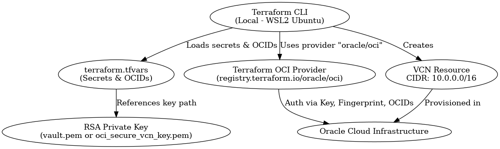

# OCI Secure VCN Terraform Project

## 📌 Business Case
This project demonstrates how to provision a secure Virtual Cloud Network (VCN) in Oracle Cloud Infrastructure (OCI) using Terraform. It provides a reproducible, automated way to deploy network infrastructure with secure key-based authentication, ensuring consistent environments for development, testing, or production use.

## 🧰 Technologies Used
| Technology              | What It Is                                                                 | Why It Was Used                                               |
|------------------------|-----------------------------------------------------------------------------|---------------------------------------------------------------|
| **Terraform**          | Infrastructure as Code (IaC) tool                                          | To declaratively define and provision OCI infrastructure      |
| **Oracle Cloud (OCI)** | Public cloud platform from Oracle                                          | Target environment for provisioning a secure Virtual Network  |
| **Terraform Provider** | Plugin that connects Terraform to external APIs                            | `oracle/oci` provider allows Terraform to interact with OCI   |
| **RSA Key Pair**       | Secure authentication method using public/private keys                     | Used to authenticate Terraform provider requests to OCI       |
| **Ubuntu WSL2**        | Linux environment on Windows via Windows Subsystem for Linux (WSL2)        | Local execution environment for Terraform and file operations |
| **Visual Studio Code** | Source code editor with integrated terminal                                | Used to manage `.tf`, `.tfvars`, and key files                |

## 🧪 Commands Used

```bash
# Install and update
sudo apt update && sudo apt install -y gnupg software-properties-common curl

# HashiCorp key and repo
curl -fsSL https://apt.releases.hashicorp.com/gpg | sudo gpg --dearmor -o /usr/share/keyrings/hashicorp-archive-keyring.gpg
echo "deb [signed-by=/usr/share/keyrings/hashicorp-archive-keyring.gpg] https://apt.releases.hashicorp.com $(lsb_release -cs) main" | sudo tee /etc/apt/sources.list.d/hashicorp.list

# Install Terraform
sudo apt update && sudo apt install terraform

# RSA key generation
openssl genrsa -out ~/.oci/oci_secure_vcn_key.pem 2048
openssl rsa -pubout -in ~/.oci/oci_secure_vcn_key.pem -out ~/.oci/oci_secure_vcn_key_public.pem
chmod 600 ~/.oci/oci_secure_vcn_key.pem

# Terraform flow
terraform init -upgrade
terraform validate
terraform plan -var-file="terraform.tfvars"
terraform apply -var-file="terraform.tfvars"
```

## 🧭 Diagram


